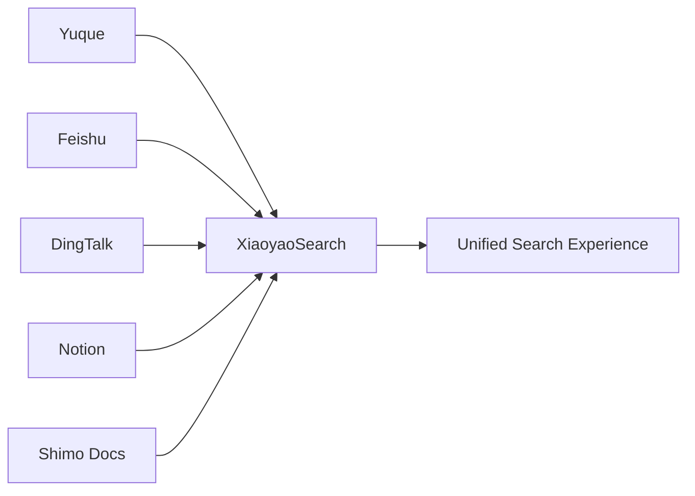
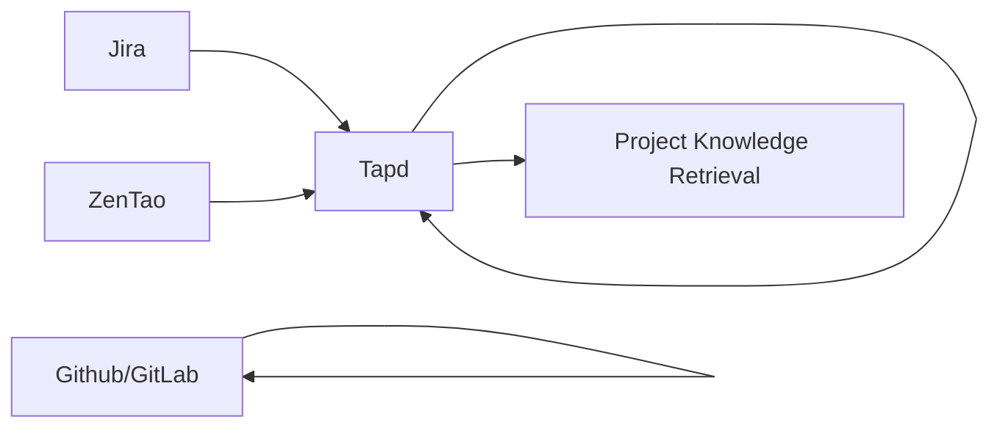
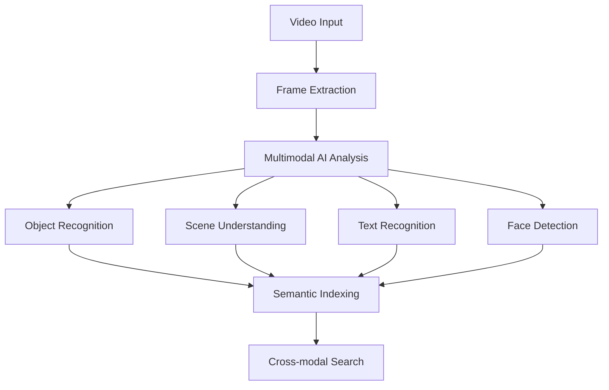
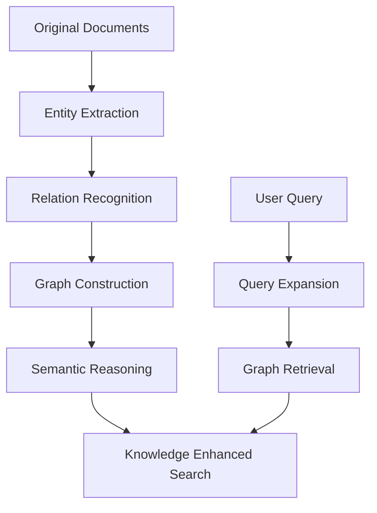
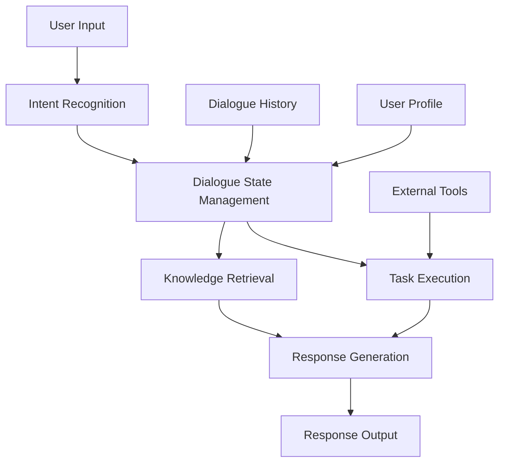
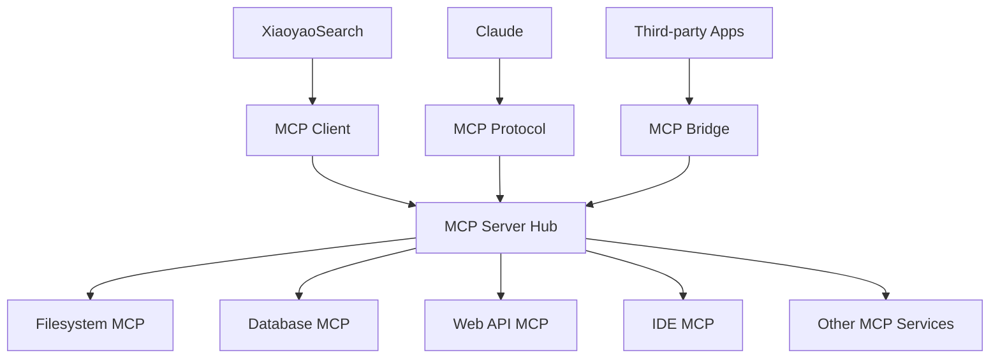

# XiaoyaoSearch - Product Roadmap

> **Current Version**: v1.0
> **Product Positioning**: Evolving from local AI search tool to intelligent knowledge work platform
> This roadmap showcases possible directions for XiaoyaoSearch to evolve from a local search tool to an intelligent knowledge work platform. Specific feature priorities and implementation details will be adjusted based on user feedback and technological developments.

## 📊 Current Achievements

### Core Capabilities
- **Multimodal AI Search**: Voice + Text + Image input, local AI processing
- **Hybrid Search Engine**: Faiss vector search + Whoosh full-text search
- **Local File Indexing**: Supports content retrieval for documents, audio/video, images, etc.
- **AI Model Integration**: BGE-M3 text embedding + FasterWhisper speech recognition + CN-CLIP image understanding + Ollama LLM
- **Desktop Application**: Electron + Vue3 cross-platform support

## 🚀 Product Evolution Directions

### 1. Microkernel Architecture Evolution

#### Current Architecture Limitations
- Tightly coupled monolithic backend architecture
- AI models and services are hard-coded integrations
- Extending new features requires modifying core code

#### Target Architecture
```
┌─────────────────────────────────────────────────────────────────────┐
│                     Plugin-based Frontend Architecture              │
│  ┌──────────────┐  ┌──────────────┐  ┌──────────────────┐        │
│  │ Search Plugin│  │ Chat Plugin  │  │ Data Source Plugin│       │
│  │ - Multimodal │  │ - AI Dialogue│  │ - Connector Mgmt  │       │
│  │ - Result Display│ │ - Context Memory│ │ - API Adaptation │       │
│  └──────────────┘  └──────────────┘  └──────────────────┘        │
├─────────────────────────────────────────────────────────────────────┤
│                     Microkernel Backend Architecture                │
│  ┌──────────────┐  ┌──────────────┐  ┌──────────────────┐        │
│  │ Core Engine  │  │ Plugin Manager│  │ Service Registry  │       │
│  │ - Search Abstract│ │ - Lifecycle  │  │ - Discovery       │       │
│  │ - Storage Abstract│ │ - Dependency Mgmt│ │ - Configuration  │       │
│  └──────────────┘  └──────────────┘  └──────────────────┘        │
├─────────────────────────────────────────────────────────────────────┤
│                     Pluggable Service Layer                         │
│  ┌──────────────┐  ┌──────────────┐  ┌──────────────────┐        │
│  │ AI Service   │  │ Storage      │  │ External          │        │
│  │   Plugin     │  │   Service Plugin│ │ Integration Plugin│       │
│  │ - Model Mgmt │  │ - Database Abstract│ │ - 3rd Party API  │       │
│  │ - Inference  │  │ - Cache Mgmt  │  │ - Webhook         │       │
│  └──────────────┘  └──────────────┘  └──────────────────┘        │
└─────────────────────────────────────────────────────────────────────┘
```

#### Technical Points
- **Plugin Framework**: Lightweight plugin system supporting hot-plugging
- **Service Discovery**: gRPC + lightweight service registration mechanism
- **Configuration Management**: Layered configuration system supporting hot reload
- **API Gateway**: Unified service entry and routing management

### 2. Multi-DataSource Expansion

#### Current Capabilities
Only supports local file system indexing and search

#### Expansion Directions

**📝 Document Collaboration Platforms**


**🛠️ Project Management Platforms**


#### Data Connector Architecture
- **Unified Interface**: Standardized data source connector interface
- **Authentication Management**: Supports OAuth2.0, API Key and other authentication methods
- **Sync Strategy**: Real-time sync, scheduled sync, on-demand sync
- **Cache Mechanism**: Intelligent caching of hot content, reducing API calls

#### Sync Strategy
- **Real-time Sync**: Webhook + Incremental updates
- **Scheduled Sync**: On-demand configuration, supports differential sync
- **On-demand Sync**: Dynamically fetch during search, cache hot content

### 3. Audio Video Search Enhancement

#### Current Limitations
- Only supports subtitle extraction for audio/video files within 10 minutes
- Lacks visual content understanding and search
- Limited audio content analysis capability

#### Video Visual Search Upgrade

**Technical Solution**


#### Key Technical Directions
- **SAM 2.0 Integration**: Video semantic segmentation and object tracking
- **Long Video Processing**: Jellyfish platform (https://www.tiderhino.com/) integration, unlimited duration
- **Multimodal Indexing**: Joint indexing of visual, audio, and subtitle content
- **Intelligent Segmentation**: Video segmentation strategy based on content changes

#### Audio Content Deep Analysis

**Capability Expansion**
- **Voiceprint Recognition**: Distinguish different speakers
- **Emotion Analysis**: Identify speech emotions and tones
- **Music Recognition**: Identify background music and sound effects
- **Silence Detection**: Intelligently skip silent segments
- **Key Information Extraction**: Automatically extract meeting points and decisions

### 4. RAG System Upgrade

#### Current Solution
Simple chunking strategy with fixed 500 characters + 50 overlap

#### Adaptive Chunking Algorithm

#### Chunking Strategy Matrix
| Content Type | Chunking Strategy | Granularity | Overlap | Optimization Goal |
|--------------|-------------------|-------------|---------|-------------------|
| Code Files | Function/Class Level | 200-800 lines | 0 | Semantic Integrity |
| Markdown Documents | Chapter/Paragraph Level | 300-600 words | 50 | Content Coherence |
| Technical Documentation | Title Hierarchy | By H1-H6 Structure | 30-80 | Structural Integrity |
| Meeting Records | Topic Switching | 2-5 minutes | 10-20 seconds | Dialogue Coherence |
| Code Repository | Module/Package | File Groups | Inter-file Dependencies | Engineering Integrity |

#### Knowledge Graph Enhancement

**Building Knowledge Graph**


#### Technical Points
- **Entity Recognition**: Integration of open-source models like BERT-NER
- **Relation Extraction**: Relation recognition based on pre-trained models
- **Graph Reasoning**: Support multi-hop reasoning and path discovery
- **Visual Exploration**: Interactive browsing of graphs

#### Intelligent Enhancement of Retrieval Results

**Multi-dimensional Result Enhancement**
- **Query Intent Understanding**: Analyze user's true intent
- **Context Information Supplementation**: Supplement context based on historical behavior
- **Relevance Reranking**: Intelligent ranking with multiple algorithm fusion
- **Answer Generation and Summarization**: Directly generate concise answers
- **Related Question Recommendation**: Recommend related questions and extended reading

### 5. Intelligent Chat Assistant

#### Function Positioning
Intelligent dialogue assistant based on local knowledge base, supporting:
- Multi-round dialogue and context memory
- Personalized Q&A based on user data
- Task-oriented dialogue (help users complete specific tasks)
- Proactive information recommendation and reminders

#### Dialogue Management Architecture



#### Core Capabilities

**Dialogue Understanding**
- Intent recognition and entity extraction
- Multi-round dialogue context management
- Emotion analysis and tone recognition

**Knowledge Q&A**
- Precise answers based on local knowledge base
- Comprehensive analysis of multi-source information
- Credibility assessment of answers

**Task Execution**
- Document organization and classification
- Information summarization and report generation
- Workflow automation

**Personalization Capabilities**
- User profile construction
- Intelligent recommendation system
- Adaptive dialogue style

### 6. MCP Capability Integration

#### MCP Overview
Claude's Model Context Protocol allows AI applications to securely connect to external data sources and tools, enabling more powerful intelligent capabilities.

#### MCP Integration Architecture



#### Core MCP Services

**Enhanced Filesystem MCP**
- Enhanced file listing with intelligent filtering and sorting
- Intelligent file content reading with format conversion and preprocessing
- Cross-file content search integrating XiaoyaoSearch capabilities
- Real-time file change monitoring

**Database Access MCP**
- Safe SQL execution with query optimization and result formatting
- Database structure analysis and recommendations
- Automated data report generation based on templates

**Web API Integration MCP**
- Secure API calls with authentication and rate limiting
- Third-party service authentication management
- Data synchronization and incremental updates

#### Claude Ecosystem Integration

**Collaboration Scenarios**
- **Intelligent Document Creation**: Claude writing + XiaoyaoSearch material retrieval
- **Code Development Assistance**: Claude programming + XiaoyaoSearch codebase retrieval
- **Data Analysis Support**: Claude analysis + XiaoyaoSearch data source connection
- **Workflow Automation**: Claude planning + XiaoyaoSearch execution and verification

## 💡 Technical Decision Points

### Key Technology Selection

#### Microkernel Architecture
- **Recommendation**: Self-developed lightweight plugin system
- **Advantage**: Better control, aligns with project characteristics, avoids over-complexity

#### Video AI Processing
- **Recommendation**: Jellyfish platform + local preprocessing
- **Advantage**: Strong processing capability, controllable cost, low technical risk

#### Knowledge Graph
- **Recommendation**: Neo4j + self-developed semantic layer
- **Advantage**: Mature graph database, good visualization, complete ecosystem

#### MCP Integration
- **Recommendation**: Active participation in Claude ecosystem
- **Advantage**: Obvious ecosystem benefits, standardized technology

### Risk Control

#### High-risk Items
- **Video Processing Cost**: Intelligent preprocessing, segmented processing, user quota management
- **Third-party API Limitations**: Multi-layer caching, incremental sync, user priority management
- **Performance Scalability**: Microservices architecture, horizontal scaling, intelligent scheduling

#### Security Considerations
- **User Privacy Security**: End-to-end encryption, permission isolation, audit logs
- **Data Source Security**: OAuth2.0 authentication, access token management, permission control