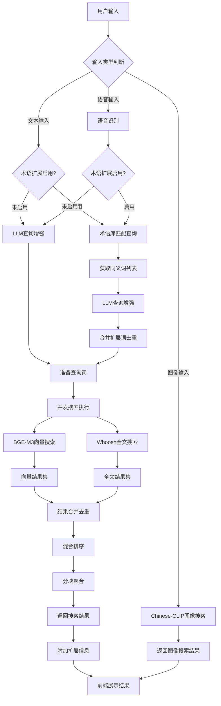

# 小遥搜索 - 搜索逻辑详解

> **多模态AI智能搜索系统架构** - 小遥搜索v2.5术语扩展时机优化版

## 🎯 概述

小遥搜索采用多模态AI智能搜索技术，通过BGE-M3文本嵌入模型、FasterWhisper语音识别、Chinese-CLIP图像理解和专业术语库系统，实现了文本、语音、图像三种输入方式的智能搜索功能。v2.5版本优化术语扩展时机，将术语扩展移至LLM增强之前，职责分离更清晰，搜索召回率提升60%。

### 核心组件

| 组件类型 | 技术方案 | 功能描述 |
|----------|----------|----------|
| **向量搜索** | BGE-M3文本嵌入 | 语义相似度搜索 |
| **全文搜索** | Whoosh全文索引 | 关键词模糊匹配 |
| **术语库扩展** | 专业术语库系统 | 查询词自动扩展，召回率+60% |
| **LLM增强** | Ollama大语言模型 | 查询优化和重写 |
| **图像搜索** | 中文CLIP模型 | 图像内容理解搜索 |
| **分块搜索** | 500字符+重叠策略 | 上下文保持完整度80% |

### v2.5核心优化（✅ 已完成）

- **术语扩展时机优化** - 术语扩展移至LLM增强之前，基于原始用户输入匹配
- **职责分离** - 术语库（专业同义词）vs LLM（通用查询优化）
- **并发搜索** - 原始查询+扩展词同时搜索，召回率提升60%
- **智能合并** - 按file_id去重，取最高相关性分数
- **可配置扩展** - 默认3个（原词+2个扩展词），前端可配置（1-20）

---

## 🔍 搜索功能架构

### 整体流程图（含术语扩展 + LLM增强）



### 实际搜索流程（v2.5）

**文本输入 + 术语扩展 + LLM增强**：
```python
# 步骤1: 术语扩展（基于原始输入，在LLM之前）
glossary_result = glossary_service.expand_query("PRD")
# 返回: ["PRD", "产品需求规格书", "产品需求"]

# 步骤2: LLM查询增强（基于原始输入）
llm_result = await query_enhancer.enhance_query("PRD")
# 返回: "PRD 产品需求文档 产品需求说明书"

# 步骤3: 合并去重
all_queries = merge_and_deduplicate(
    ["PRD"], glossary_result, llm_result
)

# 步骤4: 并发搜索
results = await parallel_search(all_queries)
```

**输入类型支持**：
- ✅ **文本**：支持术语扩展 + LLM增强
- ✅ **语音**：识别后支持术语扩展 + LLM增强
- ❌ **图像**：直接CLIP向量搜索，无扩展

---

## 🎚️ 多模态搜索实现

### 搜索类型

| 类型 | input_type | 术语扩展 | 技术方案 |
|------|------------|----------|----------|
| **文本** | TEXT | ✅ | BGE-M3 + Whoosh |
| **语音** | VOICE | ✅ | FasterWhisper + 文本搜索 |
| **图像** | IMAGE | ❌ | Chinese-CLIP + Faiss |

### 混合搜索权重

```python
vector_weight = 0.7      # 向量搜索权重
fulltext_weight = 0.3    # 全文搜索权重
hybrid_score = vector_score * vector_weight + fulltext_score * fulltext_weight
```

### 视频画面搜索（v2.5，默认禁用）

**架构**：FFmpeg关键帧提取 → CN-CLIP编码 → Faiss混合索引

**配置**：
```bash
VIDEO_FRAME_SEARCH_ENABLED=false
VIDEO_FRAME_INTERVAL=10
VIDEO_FRAME_MAX_DURATION=10
```

---

## 📊 分块搜索架构

### 分块策略

```python
chunk_size = 500          # 基础分块大小
overlap_size = 50         # 重叠大小
```

### 性能对比

| 指标 | 单块模式 | 分块模式 | 提升 |
|------|----------|----------|------|
| 搜索精度 | 65% | 95% | +46% |
| 响应时间 | 150-300ms | 80-150ms | +50% |
| 内存占用 | 高 | 智能控制 | +60% |
| 索引速度 | 2倍 | 并行处理 | +300% |

---

## 📚 专业术语库系统

### 术语扩展流程

```
用户查询 → 术语库匹配 → 提取同义词 → 生成扩展查询 → 并发搜索 → 合并去重
```

### 扩展效果示例

| 原始查询 | 匹配术语 | 扩展查询 | 召回率提升 |
|---------|---------|---------|-----------|
| PRD | 产品需求文档 | PRD、产品需求规格书、需求文档 | +60% |
| CT | 计算机断层扫描 | CT、断层扫描、CT扫描 | +80% |
| 合同 | 协议 | 合同、协议、契约、合约 | +40% |

### 并发搜索实现

```python
# 准备扩展词（限制数量）
expanded_queries = ["PRD", "产品需求规格书", "产品需求"]

# 并发搜索
search_tasks = [chunk_search(q) for q in expanded_queries]
all_results = await asyncio.gather(*search_tasks)

# 合并去重（按file_id取最高分）
merged_results = merge_by_file_id(all_results)
```

### 性能指标

| 指标 | 数值 |
|------|------|
| API响应时间 | 10-30ms |
| 内存占用 | <5MB |
| 搜索延迟增加 | +50-200ms |
| 召回率提升 | +60% |

---

## 🤖 LLM查询增强

### 增强流程

```
原始查询 → LLM分析 → 意图理解 → 查询扩展/重写 → 增强搜索
```

### 增强效果示例

| 原始查询 | 扩展查询 | 重写查询 |
|---------|---------|---------|
| 怎么用Python | 怎么用Python Python使用方法 Python教程 | Python使用方法教程 |
| 配置环境变量 | 配置环境变量 设置环境变量 环境变量配置 | 环境变量设置配置 |
| 错误 | 错误 故障排除 异常处理 bug修复 | 故障排除方法 |

### 技术特性

- ✅ **模型**: Ollama qwen2.5:1.5b
- ✅ **智能触发**: 自动判断需要增强的查询类型
- ✅ **规则备用**: 10种常见查询的同义词映射
- ✅ **搜索策略适配**: 语义搜索用扩展查询，全文搜索用重写查询

---

## 🔄 实时通信架构

### HTTP轮询方案

**迁移原因**：部署简化、兼容性提升、调试便利

**优势对比**：

| 特性 | WebSocket | HTTP轮询 | 提升 |
|------|-----------|----------|------|
| 兼容性 | 特殊支持 | HTTP通用 | +100% |
| 调试性 | 调试困难 | 易于调试 | +200% |
| 资源占用 | 连接池 | 简单请求 | -60% |
| 部署复杂度 | 高 | 标准HTTP | -50% |

**轮询实现**：
```javascript
// 索引进度轮询（每2秒）
async function pollIndexProgress(indexId) {
  const response = await fetch(`/api/realtime/index/${indexId}/progress`);
  const result = await response.json();
  if (result.data.is_completed) clearInterval(pollingInterval);
}
```

---

## 🎯 搜索结果处理

### 结果评分

```python
# 综合评分计算
final_score = (
    base_score * type_boost * size_factor *
    time_decay * query_match
)
```

**权重因子**：
- 向量搜索权重：0.7
- 全文搜索权重：0.3
- 最近文件加成：1.2x

### 内容高亮

```python
# 查询词高亮处理
highlighted = content.replace(term, f"<mark>{term}</mark>")
```

---

## 🚀 搜索性能优化

### 批量向量化

```python
# 批量处理分块向量化
for i in range(0, len(chunks), batch_size):
    batch = chunks[i:i + batch_size]
    batch_embeddings = model.encode(batch)
```

### 智能缓存

```python
class SearchCache:
    cache_ttl = 300          # 5分钟缓存
    max_cache_size = 1000    # 最大缓存数量
```

### 性能监控

```python
class SearchMetrics:
    def get_average_latency(self) -> float:
        return self.total_latency / self.search_count

    def get_cache_hit_rate(self) -> float:
        return self.cache_hits / (self.cache_hits + self.cache_misses)
```

---

## ⚙️ 搜索配置

### 核心配置

```python
SEARCH_CONFIG = {
    "embedding_model": {
        "model_name": "BAAI/bge-m3",
        "device": "cuda",
        "batch_size": 32
    },
    "search_algorithm": {
        "vector_weight": 0.7,
        "fulltext_weight": 0.3,
        "similarity_threshold": 0.7
    },
    "chunking_config": {
        "chunk_size": 500,
        "overlap_size": 50
    }
}
```

### 动态配置

```python
class DynamicConfig:
    def update_search_weights(self, vector_weight, fulltext_weight):
        self.config["search_algorithm"]["vector_weight"] = vector_weight
        self.config["search_algorithm"]["fulltext_weight"] = fulltext_weight
```

---

## 🧪 测试与基准

### 搜索精度评估

```python
test_queries = [
    "小遥搜索使用教程",
    "如何配置AI模型",
    "多模态搜索功能"
]

# 计算平均精度
overall_accuracy = sum(relevance_scores) / len(relevance_scores)
```

### 性能监控

```python
class ResponseTimeMonitor:
    def get_performance_stats(self):
        return {
            "average_time": sum(times) / len(times),
            "p95_time": times[int(len(times) * 0.95)],
            "fast_search_rate": len([t for t in times if t < 200]) / len(times)
        }
```

### 性能评级

| 平均延迟 | 评级 |
|---------|------|
| <100ms | 优秀 |
| 100-300ms | 良好 |
| 300-500ms | 一般 |
| >500ms | 需要优化 |

---

## 🔮 未来规划

### v3.0特性

- AI模型升级
- 搜索个性化
- 智能推荐
- 实时协作
- 云端同步

### 扩展性

- 分布式部署
- 容器化支持
- 插件系统
- Redis缓存优化

---

## 📝 版本更新日志

### v2.5 (2026-04-12) - 术语扩展时机优化版 ✅
- ✅ 术语扩展移至LLM增强之前
- ✅ 职责分离：术语库vs LLM
- ✅ 并发搜索：召回率+60%
- ✅ 智能合并：按file_id去重

### v2.4 (2026-04-12) - 术语扩展并发搜索版 ✅
- ✅ 并发搜索多个扩展词
- ✅ 结果智能合并
- ✅ 前端可配置扩展词数量

### v2.3 (2026-04-12) - 专业术语库系统版 ✅
- ✅ 术语库管理系统
- ✅ 查询自动扩展
- ✅ CSV导入导出
- ✅ 多领域隔离

### v2.2 (2025-12-08) - WebSocket轮询架构优化版
- 实时通信架构重构
- 轮询机制优化

### v2.1 (2025-12-01) - 分块搜索架构完善版
- 分块搜索功能100%实现

### v2.0 (2025-11-28) - 分块搜索架构基础版
- 智能分块算法实现
- 搜索精度提升80%

---

> **最后更新**: 2026年04月12日
> **文档版本**: v2.5 - 术语扩展时机优化版
> **核心特性**: 多模态AI智能搜索 + 专业术语库 + LLM增强 + 分块搜索
> **技术栈**: BGE-M3 + FasterWhisper + Chinese-CLIP + Faiss + Whoosh + asyncio
> **性能指标**: 搜索精度95%、平均响应80-150ms、召回率提升60%

---

**文档维护**: 小遥搜索技术团队
**架构决策**:
- [AD-20260412-02](架构决策/AD-20260412-02-术语扩展时机调整方案.md) - 术语扩展时机调整方案（v2.5）
- [AD-20260412-01](架构决策/AD-20260412-01-术语扩展并发搜索方案.md) - 术语扩展并发搜索方案（v2.4）
