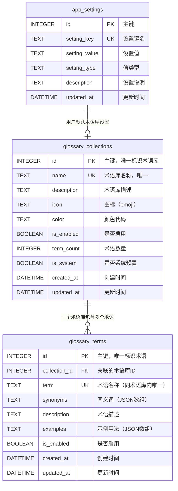

# 专业术语库系统 - 增量数据库设计文档

> **文档类型**：增量数据库设计文档
> **特性状态**：规划中
> **创建时间**：2026-04-11
> **最后更新**：2026-04-11
> **基准版本**：v4.0（云端嵌入模型支持版）
> **目标版本**：v4.1（专业术语库系统）

---

## 1. 概述

### 1.1 设计目标

建立**多术语库集合系统**，支持用户自定义领域术语库（医疗、法律、IT等），在搜索时选择性使用，实现精准查询扩展。

### 1.2 核心特性

- **多术语库管理**：支持创建多个领域术语库，每个术语库包含多个术语
- **术语同义词支持**：每个术语可配置多个同义词，支持分号分隔
- **术语库分类**：支持按领域分类（医疗、法律、IT等）
- **启用/禁用控制**：术语库和术语都支持启用/禁用状态
- **预置术语库**：系统预置4个术语库，用户可扩展
- **查询扩展**：搜索时自动使用术语库扩展查询词
- **CSV导入导出**：支持批量导入导出术语数据
- **用户默认设置**：用户可设置默认使用的术语库组合

### 1.3 技术选型

| 技术/框架 | 用途 | 选择理由 |
|----------|------|---------|
| SQLAlchemy | ORM | 与现有数据库层一致 |
| SQLite | 关系数据库 | 与现有数据库一致，支持事务 |
| Alembic | 数据库迁移 | 与现有迁移工具一致 |
| JSON | 数据格式 | 灵活存储同义词数组 |
| Python csv | CSV解析 | 标准库，无额外依赖 |

---

## 2. 数据库表结构设计

### 2.1 ER图



---

## 3. 表结构详细设计

### 3.1 glossary_collections（术语库集合表）

存储术语库的基本信息和配置。

#### 3.1.1 基础字段

| 字段名 | 数据类型 | 约束 | 说明 | 索引 |
|--------|----------|------|------|------|
| id | INTEGER | PRIMARY KEY AUTOINCREMENT | 主键，唯一标识术语库 | PRIMARY |
| name | TEXT | UNIQUE NOT NULL | 术语库名称，如"医疗术语库" | UNIQUE |
| description | TEXT | | 术语库描述，说明适用场景 | |
| icon | TEXT | | 图标（emoji），如"🏥" | |
| color | TEXT | | 颜色代码，如"#F44336" | |

#### 3.1.2 状态字段

| 字段名 | 数据类型 | 约束 | 说明 | 索引 |
|--------|----------|------|------|------|
| is_enabled | BOOLEAN | DEFAULT 1 | 是否启用（1=启用，0=禁用） | INDEX |
| is_system | BOOLEAN | DEFAULT 0 | 是否系统预置（1=系统，0=用户） | INDEX |
| term_count | INTEGER | DEFAULT 0 | 术语数量（由触发器自动维护） | |

#### 3.1.3 时间戳字段

| 字段名 | 数据类型 | 约束 | 说明 | 索引 |
|--------|----------|------|------|------|
| created_at | DATETIME | NOT NULL DEFAULT CURRENT_TIMESTAMP | 创建时间 | |
| updated_at | DATETIME | NOT NULL DEFAULT CURRENT_TIMESTAMP | 更新时间 | |

#### 3.1.4 业务约束

- **name唯一性**：术语库名称必须唯一，不允许重复
- **系统保护**：系统预置术语库（is_system=1）不可删除，只能禁用
- **级联删除**：删除术语库时，级联删除其下的所有术语

---

### 3.2 glossary_terms（术语表）

存储术语的详细信息，包括同义词、描述和示例。

#### 3.2.1 关联字段

| 字段名 | 数据类型 | 约束 | 说明 | 索引 |
|--------|----------|------|------|------|
| id | INTEGER | PRIMARY KEY AUTOINCREMENT | 主键，唯一标识术语 | PRIMARY |
| collection_id | INTEGER | NOT NULL FOREIGN KEY | 关联的术语库ID | FOREIGN KEY, INDEX |

**外键约束**：
```sql
FOREIGN KEY (collection_id) REFERENCES glossary_collections(id) ON DELETE CASCADE
```

#### 3.2.2 术语字段

| 字段名 | 数据类型 | 约束 | 说明 | 索引 |
|--------|----------|------|------|------|
| term | TEXT | NOT NULL | 术语名称，如"CT" | INDEX |
| synonyms | TEXT | NOT NULL | 同义词（JSON数组字符串） | |
| description | TEXT | | 术语描述，详细解释 | |
| examples | TEXT | | 示例用法（JSON数组字符串） | |

**synonyms字段格式**：
```json
["计算机断层扫描", "CT扫描", "Computed Tomography"]
```

**examples字段格式**：
```json
[
    "医生建议做CT检查",
    "CT扫描显示肺部有阴影"
]
```

#### 3.2.3 状态字段

| 字段名 | 数据类型 | 约束 | 说明 | 索引 |
|--------|----------|------|------|------|
| is_enabled | BOOLEAN | DEFAULT 1 | 是否启用（1=启用，0=禁用） | INDEX |

#### 3.2.4 时间戳字段

| 字段名 | 数据类型 | 约束 | 说明 | 索引 |
|--------|----------|------|------|------|
| created_at | DATETIME | NOT NULL DEFAULT CURRENT_TIMESTAMP | 创建时间 | |
| updated_at | DATETIME | NOT NULL DEFAULT CURRENT_TIMESTAMP | 更新时间 | |

#### 3.2.5 业务约束

- **术语唯一性**：同一术语库内，术语名称必须唯一
- **联合唯一约束**：UNIQUE(collection_id, term)
- **同义词格式**：必须是有效的JSON数组
- **级联删除**：删除术语库时，自动删除其下的所有术语

---

### 3.3 app_settings（应用设置表扩展）

在现有的app_settings表中新增术语库相关配置。

#### 3.3.1 新增配置项

| setting_key | setting_value | setting_type | 说明 |
|------------|---------------|--------------|------|
| default_glossary_collections | "all" 或 "[1,2,3]" | json | 默认使用的术语库ID列表，"all"表示全部 |

#### 3.3.2 配置说明

**default_glossary_collections**：
- **类型**：json
- **默认值**："all"
- **说明**：用户搜索时默认使用的术语库组合
  - "all"：使用所有已启用的术语库
  - [1,2,3]：仅使用指定ID的术语库

---

## 4. 索引设计

### 4.1 glossary_collections表索引

```sql
-- 主键索引（自动创建）
PRIMARY KEY (id)

-- 唯一索引
CREATE UNIQUE INDEX idx_gc_name ON glossary_collections(name);

-- 普通索引
CREATE INDEX idx_gc_enabled ON glossary_collections(is_enabled);
CREATE INDEX idx_gc_system ON glossary_collections(is_system);
```

**索引设计说明**：
- **idx_gc_name**：支持按名称快速查询术语库
- **idx_gc_enabled**：支持查询启用的术语库（常见操作）
- **idx_gc_system**：支持区分系统和用户术语库

### 4.2 glossary_terms表索引

```sql
-- 主键索引（自动创建）
PRIMARY KEY (id)

-- 联合唯一索引
CREATE UNIQUE INDEX idx_gt_collection_term ON glossary_terms(collection_id, term);

-- 外键索引
CREATE INDEX idx_gt_collection ON glossary_terms(collection_id);

-- 术语名称索引（用于模糊搜索）
CREATE INDEX idx_gt_term ON glossary_terms(term);

-- 启用状态索引
CREATE INDEX idx_gt_enabled ON glossary_terms(is_enabled);
```

**索引设计说明**：
- **idx_gt_collection_term**：保证同一术语库内术语名称唯一
- **idx_gt_collection**：支持按术语库查询术语
- **idx_gt_term**：支持术语名称模糊搜索
- **idx_gt_enabled**：支持查询启用的术语

---

## 5. 触发器设计

### 5.1 自动更新术语数量触发器

当插入或删除术语时，自动更新术语库的term_count字段。

#### 5.1.1 插入触发器

```sql
-- 插入术语时自动增加术语库的术语数量
CREATE TRIGGER update_collection_term_count_insert
AFTER INSERT ON glossary_terms
FOR EACH ROW
WHEN NEW.is_enabled = 1
BEGIN
  UPDATE glossary_collections
  SET term_count = term_count + 1,
      updated_at = CURRENT_TIMESTAMP
  WHERE id = NEW.collection_id;
END;
```

#### 5.1.2 删除触发器

```sql
-- 删除术语时自动减少术语库的术语数量
CREATE TRIGGER update_collection_term_count_delete
AFTER DELETE ON glossary_terms
FOR EACH ROW
WHEN OLD.is_enabled = 1
BEGIN
  UPDATE glossary_collections
  SET term_count = term_count - 1,
      updated_at = CURRENT_TIMESTAMP
  WHERE id = OLD.collection_id;
END;
```

#### 5.1.3 更新触发器

```sql
-- 更新术语启用状态时自动调整术语库的术语数量
CREATE TRIGGER update_collection_term_count_update
AFTER UPDATE OF is_enabled ON glossary_terms
FOR EACH ROW
BEGIN
  -- 从禁用变为启用
  WHEN NEW.is_enabled = 1 AND OLD.is_enabled = 0
  BEGIN
    UPDATE glossary_collections
    SET term_count = term_count + 1,
        updated_at = CURRENT_TIMESTAMP
    WHERE id = NEW.collection_id;
  END;

  -- 从启用变为禁用
  WHEN NEW.is_enabled = 0 AND OLD.is_enabled = 1
  BEGIN
    UPDATE glossary_collections
    SET term_count = term_count - 1,
        updated_at = CURRENT_TIMESTAMP
    WHERE id = NEW.collection_id;
  END;
END;
```

### 5.2 自动更新时间戳触发器

```sql
-- 更新术语库时自动更新updated_at字段
CREATE TRIGGER update_collection_timestamp
AFTER UPDATE ON glossary_collections
FOR EACH ROW
BEGIN
  UPDATE glossary_collections
  SET updated_at = CURRENT_TIMESTAMP
  WHERE id = NEW.id;
END;

-- 更新术语时自动更新updated_at字段
CREATE TRIGGER update_term_timestamp
AFTER UPDATE ON glossary_terms
FOR EACH ROW
BEGIN
  UPDATE glossary_terms
  SET updated_at = CURRENT_TIMESTAMP
  WHERE id = NEW.id;
END;
```

---

## 6. 数据迁移脚本

### 6.1 Alembic迁移脚本

```python
# alembic/versions/004_add_glossary_tables.py
"""添加专业术语库系统表

Revision ID: 004_add_glossary_tables
Revises: 003_add_plugin_source_fields
Create Date: 2026-04-11
说明: 新增glossary_collections和glossary_terms表，支持术语库管理和查询扩展
"""
from alembic import op
import sqlalchemy as sa
from sqlalchemy.dialects import sqlite

# revision identifiers
revision = '004_add_glossary_tables'
down_revision = '003_add_plugin_source_fields'
branch_labels = None
depends_on = None


def upgrade():
    """升级：创建术语库相关表"""

    # 1. 创建glossary_collections表
    op.create_table(
        'glossary_collections',
        sa.Column('id', sa.Integer(), autoincrement=True, nullable=False),
        sa.Column('name', sa.Text(), nullable=False),
        sa.Column('description', sa.Text(), nullable=True),
        sa.Column('icon', sa.Text(), nullable=True),
        sa.Column('color', sa.Text(), nullable=True),
        sa.Column('is_enabled', sa.Boolean(), default=True, nullable=False),
        sa.Column('term_count', sa.Integer(), default=0, nullable=False),
        sa.Column('is_system', sa.Boolean(), default=False, nullable=False),
        sa.Column('created_at', sa.DateTime(), nullable=False, server_default=sa.text('CURRENT_TIMESTAMP')),
        sa.Column('updated_at', sa.DateTime(), nullable=False, server_default=sa.text('CURRENT_TIMESTAMP')),
        sa.PrimaryKeyConstraint('id', name='pk_glossary_collections'),
        sa.UniqueConstraint('name', name='uq_glossary_collections_name')
    )
    op.create_index('idx_gc_name', 'glossary_collections', ['name'])
    op.create_index('idx_gc_enabled', 'glossary_collections', ['is_enabled'])
    op.create_index('idx_gc_system', 'glossary_collections', ['is_system'])

    # 2. 创建glossary_terms表
    op.create_table(
        'glossary_terms',
        sa.Column('id', sa.Integer(), autoincrement=True, nullable=False),
        sa.Column('collection_id', sa.Integer(), nullable=False),
        sa.Column('term', sa.Text(), nullable=False),
        sa.Column('synonyms', sa.Text(), nullable=False),
        sa.Column('description', sa.Text(), nullable=True),
        sa.Column('examples', sa.Text(), nullable=True),
        sa.Column('is_enabled', sa.Boolean(), default=True, nullable=False),
        sa.Column('created_at', sa.DateTime(), nullable=False, server_default=sa.text('CURRENT_TIMESTAMP')),
        sa.Column('updated_at', sa.DateTime(), nullable=False, server_default=sa.text('CURRENT_TIMESTAMP')),
        sa.PrimaryKeyConstraint('id', name='pk_glossary_terms'),
        sa.ForeignKeyConstraint(['collection_id'], ['glossary_collections.id'], ondelete='CASCADE'),
        sa.UniqueConstraint('collection_id', 'term', name='uq_glossary_terms_collection_term')
    )
    op.create_index('idx_gt_collection', 'glossary_terms', ['collection_id'])
    op.create_index('idx_gt_term', 'glossary_terms', ['term'])
    op.create_index('idx_gt_enabled', 'glossary_terms', ['is_enabled'])

    # 3. 创建触发器（SQLite语法）
    # 插入术语时自动增加术语库的术语数量
    op.execute("""
        CREATE TRIGGER update_collection_term_count_insert
        AFTER INSERT ON glossary_terms
        FOR EACH ROW
        WHEN NEW.is_enabled = 1
        BEGIN
          UPDATE glossary_collections
          SET term_count = term_count + 1,
              updated_at = CURRENT_TIMESTAMP
          WHERE id = NEW.collection_id;
        END
    """)

    # 删除术语时自动减少术语库的术语数量
    op.execute("""
        CREATE TRIGGER update_collection_term_count_delete
        AFTER DELETE ON glossary_terms
        FOR EACH ROW
        WHEN OLD.is_enabled = 1
        BEGIN
          UPDATE glossary_collections
          SET term_count = term_count - 1,
              updated_at = CURRENT_TIMESTAMP
          WHERE id = OLD.collection_id;
        END
    """)

    # 更新术语启用状态时自动调整术语库的术语数量
    op.execute("""
        CREATE TRIGGER update_collection_term_count_update
        AFTER UPDATE OF is_enabled ON glossary_terms
        FOR EACH ROW
        WHEN NEW.is_enabled != OLD.is_enabled
        BEGIN
          UPDATE glossary_collections
          SET term_count = term_count + CASE
              WHEN NEW.is_enabled = 1 THEN 1
              ELSE -1
          END,
          updated_at = CURRENT_TIMESTAMP
          WHERE id = NEW.collection_id;
        END
    """)

    # 4. 在app_settings表中插入默认配置
    op.execute("""
        INSERT INTO app_settings (setting_key, setting_value, setting_type, description, updated_at)
        VALUES (
            'default_glossary_collections',
            'all',
            'json',
            '默认使用的术语库ID列表，"all"表示全部',
            CURRENT_TIMESTAMP
        )
        ON CONFLICT(setting_key) DO UPDATE SET
            setting_value = 'all',
            updated_at = CURRENT_TIMESTAMP
    """)


def downgrade():
    """降级：删除术语库相关表"""

    # 1. 删除触发器
    op.execute("DROP TRIGGER IF EXISTS update_collection_term_count_insert")
    op.execute("DROP TRIGGER IF EXISTS update_collection_term_count_delete")
    op.execute("DROP TRIGGER IF EXISTS update_collection_term_count_update")

    # 2. 删除索引
    op.drop_index('idx_gt_enabled', table_name='glossary_terms')
    op.drop_index('idx_gt_term', table_name='glossary_terms')
    op.drop_index('idx_gt_collection', table_name='glossary_terms')
    op.drop_index('idx_gc_system', table_name='glossary_collections')
    op.drop_index('idx_gc_enabled', table_name='glossary_collections')
    op.drop_index('idx_gc_name', table_name='glossary_collections')

    # 3. 删除表
    op.drop_table('glossary_terms')
    op.drop_table('glossary_collections')

    # 4. 删除app_settings中的配置
    op.execute("DELETE FROM app_settings WHERE setting_key = 'default_glossary_collections'")
```

### 6.2 SQL迁移脚本

```sql
-- =====================================================
-- 专业术语库系统数据库迁移脚本
-- 版本: v4.1.0
-- 日期: 2026-04-11
-- 说明: 新增术语库管理和查询扩展功能
-- =====================================================

-- 1. 创建glossary_collections表
CREATE TABLE IF NOT EXISTS glossary_collections (
    id INTEGER PRIMARY KEY AUTOINCREMENT,
    name TEXT NOT NULL UNIQUE,
    description TEXT,
    icon TEXT,
    color TEXT,
    is_enabled BOOLEAN DEFAULT 1,
    term_count INTEGER DEFAULT 0,
    is_system BOOLEAN DEFAULT 0,
    created_at DATETIME DEFAULT CURRENT_TIMESTAMP,
    updated_at DATETIME DEFAULT CURRENT_TIMESTAMP
);

-- 2. 创建glossary_collections表索引
CREATE INDEX IF NOT EXISTS idx_gc_name ON glossary_collections(name);
CREATE INDEX IF NOT EXISTS idx_gc_enabled ON glossary_collections(is_enabled);
CREATE INDEX IF NOT EXISTS idx_gc_system ON glossary_collections(is_system);

-- 3. 创建glossary_terms表
CREATE TABLE IF NOT EXISTS glossary_terms (
    id INTEGER PRIMARY KEY AUTOINCREMENT,
    collection_id INTEGER NOT NULL,
    term TEXT NOT NULL,
    synonyms TEXT NOT NULL,
    description TEXT,
    examples TEXT,
    is_enabled BOOLEAN DEFAULT 1,
    created_at DATETIME DEFAULT CURRENT_TIMESTAMP,
    updated_at DATETIME DEFAULT CURRENT_TIMESTAMP,
    FOREIGN KEY (collection_id) REFERENCES glossary_collections(id) ON DELETE CASCADE,
    UNIQUE(collection_id, term)
);

-- 4. 创建glossary_terms表索引
CREATE INDEX IF NOT EXISTS idx_gt_collection ON glossary_terms(collection_id);
CREATE INDEX IF NOT EXISTS idx_gt_term ON glossary_terms(term);
CREATE INDEX IF NOT EXISTS idx_gt_enabled ON glossary_terms(is_enabled);

-- 5. 创建触发器
-- 插入术语时自动增加术语库的术语数量
CREATE TRIGGER IF NOT EXISTS update_collection_term_count_insert
AFTER INSERT ON glossary_terms
FOR EACH ROW
WHEN NEW.is_enabled = 1
BEGIN
  UPDATE glossary_collections
  SET term_count = term_count + 1,
      updated_at = CURRENT_TIMESTAMP
  WHERE id = NEW.collection_id;
END;

-- 删除术语时自动减少术语库的术语数量
CREATE TRIGGER IF NOT EXISTS update_collection_term_count_delete
AFTER DELETE ON glossary_terms
FOR EACH ROW
WHEN OLD.is_enabled = 1
BEGIN
  UPDATE glossary_collections
  SET term_count = term_count - 1,
      updated_at = CURRENT_TIMESTAMP
  WHERE id = OLD.collection_id;
END;

-- 更新术语启用状态时自动调整术语库的术语数量
CREATE TRIGGER IF NOT EXISTS update_collection_term_count_update
AFTER UPDATE OF is_enabled ON glossary_terms
FOR EACH ROW
WHEN NEW.is_enabled != OLD.is_enabled
BEGIN
  UPDATE glossary_collections
  SET term_count = term_count + CASE
      WHEN NEW.is_enabled = 1 THEN 1
      ELSE -1
  END,
  updated_at = CURRENT_TIMESTAMP
  WHERE id = NEW.collection_id;
END;

-- 6. 在app_settings表中插入默认配置
INSERT OR REPLACE INTO app_settings (setting_key, setting_value, setting_type, description, updated_at)
VALUES (
    'default_glossary_collections',
    'all',
    'json',
    '默认使用的术语库ID列表，"all"表示全部',
    CURRENT_TIMESTAMP
);

-- 7. 验证迁移结果
SELECT
    'glossary_collections' as table_name,
    COUNT(*) as row_count
FROM glossary_collections
UNION ALL
SELECT
    'glossary_terms' as table_name,
    COUNT(*) as row_count
FROM glossary_terms;
```

### 6.3 回滚脚本

```sql
-- =====================================================
-- 回滚脚本
-- 说明: 移除专业术语库系统相关表和配置
-- =====================================================

-- 1. 删除触发器
DROP TRIGGER IF EXISTS update_collection_term_count_insert;
DROP TRIGGER IF EXISTS update_collection_term_count_delete;
DROP TRIGGER IF EXISTS update_collection_term_count_update;

-- 2. 删除索引
DROP INDEX IF EXISTS idx_gt_enabled;
DROP INDEX IF EXISTS idx_gt_term;
DROP INDEX IF EXISTS idx_gt_collection;
DROP INDEX IF EXISTS idx_gc_system;
DROP INDEX IF EXISTS idx_gc_enabled;
DROP INDEX IF EXISTS idx_gc_name;

-- 3. 删除表（注意：glossary_terms会因为外键约束自动删除）
DROP TABLE IF EXISTS glossary_terms;
DROP TABLE IF EXISTS glossary_collections;

-- 4. 删除app_settings中的配置
DELETE FROM app_settings WHERE setting_key = 'default_glossary_collections';
```

---

## 7. 预置数据初始化

### 7.1 预置术语库数据

系统预置4个术语库，涵盖常见专业领域。

#### 7.1.1 医疗术语库

```sql
-- 创建医疗术语库
INSERT INTO glossary_collections (name, description, icon, color, is_system)
VALUES ('医疗术语库', '医学领域的专业术语，包括检查、疾病、药物等', '🏥', '#F44336', 1);

-- 获取刚创建的医疗术语库ID（假设为1）
-- 插入医疗术语示例
INSERT INTO glossary_terms (collection_id, term, synonyms, description, examples) VALUES
(1, 'CT', '["计算机断层扫描", "CT扫描", "Computed Tomography"]', '计算机断层扫描，一种医学影像检查技术', '["医生建议做CT检查", "CT扫描显示肺部有阴影"]'),
(1, 'MRI', '["磁共振成像", "核磁共振", "Magnetic Resonance Imaging"]', '磁共振成像，一种无辐射的医学影像检查技术', '["需要做MRI检查膝盖", "核磁共振检查无辐射"]'),
(1, 'ECG', '["心电图", "Electrocardiogram"]', '心电图，记录心脏电活动的检查', '["心电图显示心律不齐", "做心电图检查"]'),
(1, '血压', '["BP", "Blood Pressure"]', '血液在血管内流动时对血管壁产生的压力', '["测量血压", "血压偏高"]'),
(1, '糖尿病', '["DM", "Diabetes Mellitus"]', '一种以高血糖为特征的代谢性疾病', '["糖尿病患者需要控制饮食", "监测血糖水平"]');
```

#### 7.1.2 法律术语库

```sql
-- 创建法律术语库
INSERT INTO glossary_collections (name, description, icon, color, is_system)
VALUES ('法律术语库', '法律领域的专业术语，包括法规、诉讼、合同等', '⚖️', '#9C27B0', 1);

-- 插入法律术语示例
INSERT INTO glossary_terms (collection_id, term, synonyms, description, examples) VALUES
(2, '民法典', '["Civil Code"]', '调整平等主体的自然人、法人和非法人组织之间的人身关系和财产关系的基本法律', '["根据民法典相关规定", "民法典侵权责任编"]'),
(2, '合同法', '["Contract Law"]', '调整合同关系的法律规范总称', '["签订合同要遵守合同法", "合同法基本原则"]'),
(2, '知识产权', '["IP", "Intellectual Property"]', '人们对其智力创造成果享有的专有权利', '["保护知识产权", "知识产权侵权纠纷"]'),
(2, '诉讼时效', '["Statute of Limitations"]', '权利人请求人民法院保护其民事权利的法定期间', '["注意诉讼时效", "诉讼时效为三年"]'),
(2, '违约责任', '["Breach of Contract"]', '当事人不履行合同义务或履行合同义务不符合约定应承担的民事责任', '["承担违约责任", "违约责任赔偿方式"]');
```

#### 7.1.3 产品术语库

```sql
-- 创建产品术语库
INSERT INTO glossary_collections (name, description, icon, color, is_system)
VALUES ('产品术语库', '产品管理和设计领域的专业术语', '📦', '#FF9800', 1);

-- 插入产品术语示例
INSERT INTO glossary_terms (collection_id, term, synonyms, description, examples) VALUES
(3, 'PRD', '["产品需求文档", "Product Requirements Document"]', '产品需求文档，描述产品功能需求的文档', '["编写PRD文档", "PRD评审会议"]'),
(3, 'MRD', '["市场需求文档", "Market Requirements Document"]', '市场需求文档，描述市场需求和机会的文档', '["MRD分析", "市场需求文档MRD"]'),
(3, 'BRD', '["商业需求文档", "Business Requirements Document"]', '商业需求文档，描述商业目标和需求的文档', '["BRD讨论", "商业需求文档BRD"]'),
(3, 'MVP', '["最小可行产品", "Minimum Viable Product"]', '最小可行产品，具有最基本功能的产品版本', '["发布MVP版本", "最小可行产品MVP"]'),
(3, 'OKR', '["目标与关键成果", "Objectives and Key Results"]', '目标与关键成果法，一种目标管理框架', '["设定OKR目标", "季度OKR回顾"]'),
(3, 'KPI', '["关键绩效指标", "Key Performance Indicators"]', '关键绩效指标，衡量目标达成情况的量化指标', '["设定KPI指标", "KPI考核"]'),
(3, '用户画像', '["User Persona", "用户角色"]', '基于用户研究创建的典型用户角色描述', '["创建用户画像", "目标用户画像分析"]'),
(3, '用户体验', '["UX", "User Experience"]', '用户使用产品过程中的整体感受和体验', '["优化用户体验", "提升UX设计"]');
```

#### 7.1.4 IT技术术语库

```sql
-- 创建IT技术术语库
INSERT INTO glossary_collections (name, description, icon, color, is_system)
VALUES ('IT技术术语库', 'IT技术和开发领域的专业术语', '💻', '#2196F3', 1);

-- 插入IT技术术语示例
INSERT INTO glossary_terms (collection_id, term, synonyms, description, examples) VALUES
(4, 'API', '["应用程序接口", "Application Programming Interface"]', '应用程序接口，不同软件组件之间通信的接口', '["调用API接口", "RESTful API设计"]'),
(4, 'SDK', '["软件开发工具包", "Software Development Kit"]', '软件开发工具包，帮助开发者创建应用的工具集', '["下载SDK", "集成SDK到项目"]'),
(4, 'REST', '["表述性状态传递", "Representational State Transfer"]', '一种软件架构风格，常用于Web服务设计', '["REST API设计", "RESTful架构"]'),
(4, 'JSON', '["JavaScript对象表示法", "JavaScript Object Notation"]', '一种轻量级的数据交换格式', '["解析JSON数据", "返回JSON格式"]'),
(4, 'CI/CD', '["持续集成/持续部署", "Continuous Integration/Continuous Deployment"]', '持续集成和持续部署的自动化开发实践', '["搭建CI/CD流水线", "持续集成部署"]'),
(4, 'Docker', '["容器化技术"]', '一种容器化技术，用于打包和分发应用', '["使用Docker部署", "Docker容器管理"]'),
(4, 'Git', '["版本控制系统"]', '一种分布式版本控制系统', '["Git提交代码", "Git分支管理"]'),
(4, '微服务', '["Microservices"]', '一种将应用拆分为多个小型服务的架构风格', '["微服务架构设计", "拆分为微服务"]');
```

### 7.2 初始化脚本

```python
# backend/app/core/glossary_init.py
"""
预置术语库初始化脚本
"""
from sqlalchemy.orm import Session
from app.models.glossary_collection import GlossaryCollectionModel
from app.models.glossary_term import GlossaryTermModel
import json


async def initialize_presets(db: Session) -> bool:
    """
    初始化预置术语库

    如果术语库已存在，则跳过创建（支持增量更新）
    """
    try:
        # 预置术语库定义
        presets = [
            {
                "name": "医疗术语库",
                "description": "医学领域的专业术语，包括检查、疾病、药物等",
                "icon": "🏥",
                "color": "#F44336",
                "terms": [
                    {
                        "term": "CT",
                        "synonyms": ["计算机断层扫描", "CT扫描", "Computed Tomography"],
                        "description": "计算机断层扫描，一种医学影像检查技术",
                        "examples": ["医生建议做CT检查", "CT扫描显示肺部有阴影"]
                    },
                    # ... 更多医疗术语
                ]
            },
            # ... 其他预置术语库
        ]

        for preset in presets:
            # 检查术语库是否已存在
            existing = db.query(GlossaryCollectionModel).filter(
                GlossaryCollectionModel.name == preset["name"]
            ).first()

            if existing:
                # 术语库已存在，跳过
                continue

            # 创建术语库
            collection = GlossaryCollectionModel(
                name=preset["name"],
                description=preset["description"],
                icon=preset["icon"],
                color=preset["color"],
                is_system=True
            )
            db.add(collection)
            db.flush()  # 获取collection.id

            # 创建术语
            for term_data in preset["terms"]:
                term = GlossaryTermModel(
                    collection_id=collection.id,
                    term=term_data["term"],
                    synonyms=json.dumps(term_data["synonyms"], ensure_ascii=False),
                    description=term_data["description"],
                    examples=json.dumps(term_data.get("examples", []), ensure_ascii=False)
                )
                db.add(term)

        db.commit()
        return True

    except Exception as e:
        db.rollback()
        raise e
```

---

## 8. 数据字典

### 8.1 glossary_collections表数据字典

| 字段名 | 数据类型 | 长度 | 可空 | 默认值 | 索引 | 说明 |
|--------|----------|------|------|--------|------|------|
| id | INTEGER | - | 否 | AUTOINCREMENT | PRIMARY | 主键 |
| name | TEXT | - | 否 | - | UNIQUE | 术语库名称 |
| description | TEXT | - | 是 | NULL | - | 术语库描述 |
| icon | TEXT | - | 是 | NULL | - | 图标（emoji） |
| color | TEXT | - | 是 | NULL | - | 颜色代码 |
| is_enabled | BOOLEAN | - | 否 | 1 | INDEX | 是否启用 |
| term_count | INTEGER | - | 否 | 0 | - | 术语数量 |
| is_system | BOOLEAN | - | 否 | 0 | INDEX | 是否系统预置 |
| created_at | DATETIME | - | 否 | CURRENT_TIMESTAMP | - | 创建时间 |
| updated_at | DATETIME | - | 否 | CURRENT_TIMESTAMP | - | 更新时间 |

### 8.2 glossary_terms表数据字典

| 字段名 | 数据类型 | 长度 | 可空 | 默认值 | 索引 | 说明 |
|--------|----------|------|------|--------|------|------|
| id | INTEGER | - | 否 | AUTOINCREMENT | PRIMARY | 主键 |
| collection_id | INTEGER | - | 否 | - | FOREIGN KEY | 术语库ID |
| term | TEXT | - | 否 | - | INDEX | 术语名称 |
| synonyms | TEXT | - | 否 | - | - | 同义词（JSON） |
| description | TEXT | - | 是 | NULL | - | 术语描述 |
| examples | TEXT | - | 是 | NULL | - | 示例用法（JSON） |
| is_enabled | BOOLEAN | - | 否 | 1 | INDEX | 是否启用 |
| created_at | DATETIME | - | 否 | CURRENT_TIMESTAMP | - | 创建时间 |
| updated_at | DATETIME | - | 否 | CURRENT_TIMESTAMP | - | 更新时间 |

---

## 9. 典型查询示例

### 9.1 术语库管理查询

```sql
-- 查询所有启用的术语库
SELECT id, name, icon, color, term_count
FROM glossary_collections
WHERE is_enabled = 1
ORDER BY term_count DESC;

-- 查询系统和用户术语库统计
SELECT
    is_system,
    COUNT(*) as collection_count,
    SUM(term_count) as total_terms
FROM glossary_collections
GROUP BY is_system;

-- 查询术语库详情及其术语数量
SELECT
    gc.*,
    COUNT(gt.id) as actual_term_count
FROM glossary_collections gc
LEFT JOIN glossary_terms gt ON gc.id = gt.collection_id AND gt.is_enabled = 1
WHERE gc.id = ?
GROUP BY gc.id;
```

### 9.2 术语查询

```sql
-- 查询指定术语库的所有术语（分页）
SELECT
    id,
    term,
    synonyms,
    description,
    is_enabled
FROM glossary_terms
WHERE collection_id = ? AND is_enabled = 1
ORDER BY term ASC
LIMIT ? OFFSET ?;

-- 模糊搜索术语（支持术语名称和同义词）
SELECT
    gt.id,
    gt.term,
    gt.synonyms,
    gt.description,
    gc.name as collection_name,
    gc.icon as collection_icon
FROM glossary_terms gt
JOIN glossary_collections gc ON gt.collection_id = gc.id
WHERE gt.is_enabled = 1
  AND gc.is_enabled = 1
  AND (
      gt.term LIKE '%?%'
      OR gt.synonyms LIKE '%?%'
  )
ORDER BY gt.term;

-- 查询术语的同义词
SELECT synonyms
FROM glossary_terms
WHERE id = ?;
```

### 9.3 查询扩展相关查询

```sql
-- 查询用户默认术语库配置
SELECT setting_value
FROM app_settings
WHERE setting_key = 'default_glossary_collections';

-- 查询所有启用的术语库（用于"all"模式）
SELECT id, name
FROM glossary_collections
WHERE is_enabled = 1;

-- 查询指定术语库的所有术语（用于查询扩展）
SELECT term, synonyms
FROM glossary_terms
WHERE collection_id IN (1, 2, 3)
  AND is_enabled = 1;
```

---

## 10. 性能优化建议

### 10.1 查询优化

1. **使用索引覆盖**
   ```sql
   -- 优化前（SELECT *）
   SELECT * FROM glossary_terms WHERE collection_id = ?;

   -- 优化后（只查询需要的字段）
   SELECT id, term, synonyms FROM glossary_terms WHERE collection_id = ?;
   ```

2. **批量查询优化**
   ```sql
   -- 批量查询多个术语库的术语
   SELECT gt.id, gt.term, gt.synonyms, gc.name as collection_name
   FROM glossary_terms gt
   JOIN glossary_collections gc ON gt.collection_id = gc.id
   WHERE gt.collection_id IN (1, 2, 3, 4)
     AND gt.is_enabled = 1
     AND gc.is_enabled = 1;
   ```

3. **术语匹配优化**
   ```sql
   -- 使用全文搜索（如果SQLite支持FTS5）
   CREATE VIRTUAL TABLE glossary_terms_fts USING fts5(
       term, synonyms, description,
       content='glossary_terms',
       content_rowid='id'
   );

   -- 全文搜索
   SELECT gt.*, gc.name as collection_name
   FROM glossary_terms_fts
   JOIN glossary_terms gt ON glossary_terms_fts.id = gt.id
   JOIN glossary_collections gc ON gt.collection_id = gc.id
   WHERE glossary_terms_fts MATCH ?
   ORDER BY rank;
   ```

### 10.2 缓存策略

1. **术语库列表缓存**：TTL 5分钟
2. **术语同义词缓存**：TTL 10分钟
3. **用户设置缓存**：TTL 30分钟

### 10.3 数据库维护

```sql
-- 分析索引使用情况
ANALYZE glossary_collections;
ANALYZE glossary_terms;

-- 重建索引（碎片整理）
REINDEX glossary_collections;
REINDEX glossary_terms;

-- 查看索引统计信息
SELECT
    name,
    tbl_name,
    sql
FROM sqlite_master
WHERE type = 'index'
  AND tbl_name IN ('glossary_collections', 'glossary_terms');
```

---

## 11. 数据完整性约束

### 11.1 检查约束

```sql
-- 确保术语库名称不为空
CREATE TRIGGER validate_collection_name
BEFORE INSERT ON glossary_collections
BEGIN
  SELECT CASE
    WHEN NEW.name IS NULL OR NEW.name = ''
    THEN RAISE(ABORT, '术语库名称不能为空')
  END;
END;

-- 确保术语名称不为空
CREATE TRIGGER validate_term_name
BEFORE INSERT ON glossary_terms
BEGIN
  SELECT CASE
    WHEN NEW.term IS NULL OR NEW.term = ''
    THEN RAISE(ABORT, '术语名称不能为空')
  END;
END;

-- 确保同义词不为空
CREATE TRIGGER validate_term_synonyms
BEFORE INSERT ON glossary_terms
BEGIN
  SELECT CASE
    WHEN NEW.synonyms IS NULL OR NEW.synonyms = ''
    THEN RAISE(ABORT, '同义词不能为空')
  END;
END;
```

### 11.2 数据一致性检查

```sql
-- 检查孤立的术语（术语库不存在）
SELECT gt.id, gt.term, gt.collection_id
FROM glossary_terms gt
LEFT JOIN glossary_collections gc ON gt.collection_id = gc.id
WHERE gc.id IS NULL;

-- 检查术语库的term_count是否准确
SELECT
    gc.id,
    gc.name,
    gc.term_count as expected_count,
    COUNT(gt.id) as actual_count
FROM glossary_collections gc
LEFT JOIN glossary_terms gt ON gc.id = gt.collection_id AND gt.is_enabled = 1
GROUP BY gc.id
HAVING expected_count != actual_count;

-- 修复term_count（如果发现不一致）
UPDATE glossary_collections
SET term_count = (
    SELECT COUNT(*)
    FROM glossary_terms
    WHERE glossary_terms.collection_id = glossary_collections.id
      AND glossary_terms.is_enabled = 1
);
```

---

## 12. 安全考虑

### 12.1 SQL注入防护

- 使用参数化查询，避免拼接SQL
- 使用ORM框架（SQLAlchemy）自动转义输入

### 12.2 数据访问控制

| 操作 | 权限要求 | 说明 |
|------|---------|------|
| 查看术语库 | 所有用户 | 只读访问 |
| 创建术语库 | 登录用户 | 用户可创建自定义术语库 |
| 修改术语库 | 所有者或管理员 | 只能修改自己创建的术语库 |
| 删除术语库 | 所有者或管理员 | 系统预置术语库不可删除 |
| 修改术语 | 所有者或管理员 | 只能修改自己创建术语库的术语 |

---

## 13. 备份与恢复

### 13.1 备份策略

```bash
# 备份术语库相关表
sqlite3 xiaoyao_search.db <<EOF
.backup glossary_backup.sql
.output glossary_backup.sql
.dump glossary_collections
.dump glossary_terms
.quit
EOF
```

### 13.2 恢复策略

```bash
# 恢复术语库相关表
sqlite3 xiaoyao_search.db < glossary_backup.sql
```

---

## 14. 与现有系统的集成

### 14.1 与搜索服务集成

术语库通过查询扩展与搜索服务集成：

1. 用户输入查询词
2. 搜索服务调用术语扩展服务
3. 术语服务返回匹配术语及其同义词
4. 搜索服务对每个扩展词执行搜索
5. 合并去重搜索结果
6. 返回综合结果

### 14.2 与用户设置集成

用户可在设置页面配置：

1. 是否启用术语扩展（默认启用）
2. 默认使用的术语库（全部或指定）
3. 跳转到术语库管理页面

### 14.3 与文件索引集成

术语库独立于文件索引：

- 不影响现有索引流程
- 仅在搜索时进行查询扩展
- 可随时启用/禁用

---

## 15. 实施检查清单

### 15.1 数据库迁移

- [ ] 创建glossary_collections表
- [ ] 创建glossary_terms表
- [ ] 创建所有索引
- [ ] 创建所有触发器
- [ ] 在app_settings表中插入默认配置
- [ ] 执行迁移脚本验证

### 15.2 预置数据初始化

- [ ] 创建医疗术语库（50+术语）
- [ ] 创建法律术语库（30+术语）
- [ ] 创建产品术语库（40+术语）
- [ ] 创建IT技术术语库（40+术语）
- [ ] 验证预置数据正确性

### 15.3 功能验证

- [ ] 术语库CRUD功能正常
- [ ] 术语CRUD功能正常
- [ ] 触发器自动更新term_count
- [ ] 查询扩展功能正常
- [ ] CSV导入导出功能正常
- [ ] 用户设置保存和读取正常

### 15.4 性能验证

- [ ] 术语匹配<50ms
- [ ] 批量查询优化有效
- [ ] 索引使用率正常
- [ ] 数据库查询无死锁

---

## 16. 版本历史

| 版本 | 日期 | 说明 |
|------|------|------|
| v4.1.0 | 2026-04-11 | 初始版本，新增术语库系统 |

---

**文档结束**

> **使用说明**：
> 1. 本文档为专业术语库特性的增量数据库设计文档
> 2. 与PRD、原型、技术方案、任务清单、API文档配合使用
> 3. 实施时请按照15章"实施检查清单"进行验证
> 4. 数据库迁移前务必备份现有数据库
